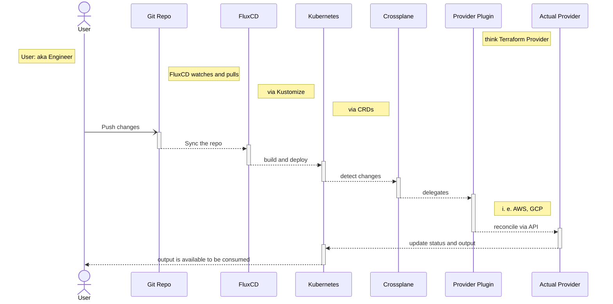
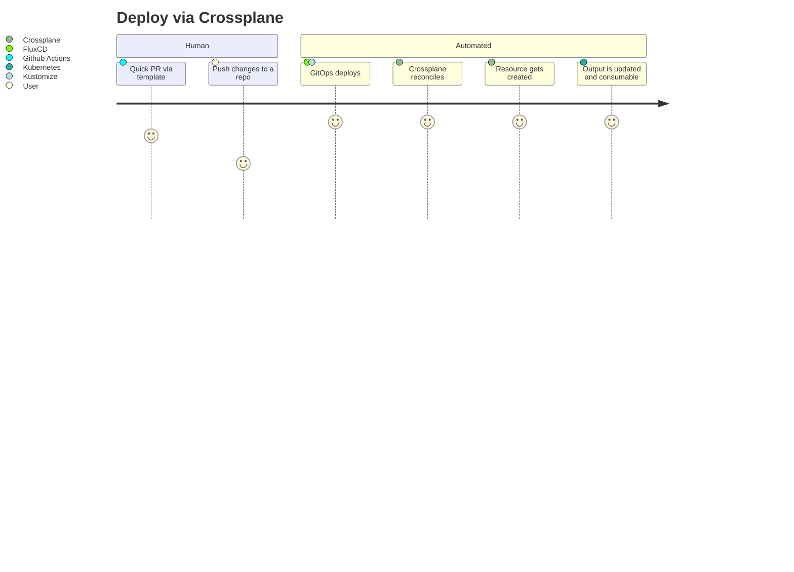
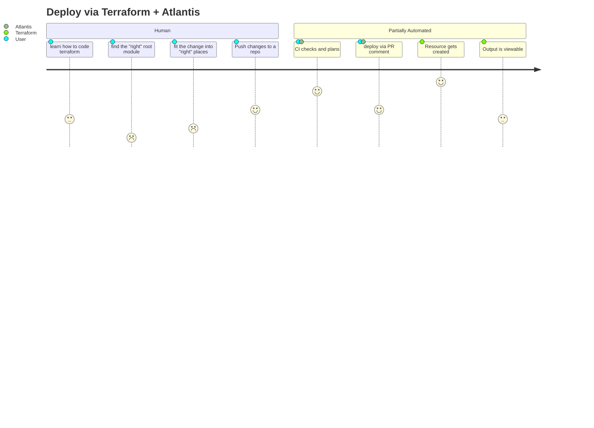
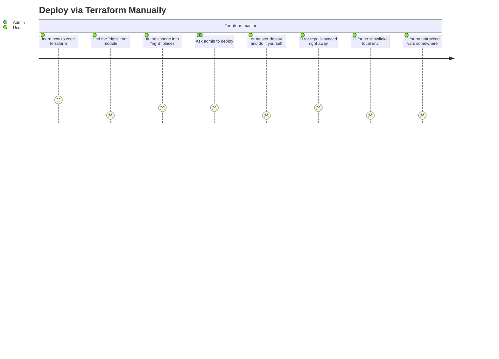
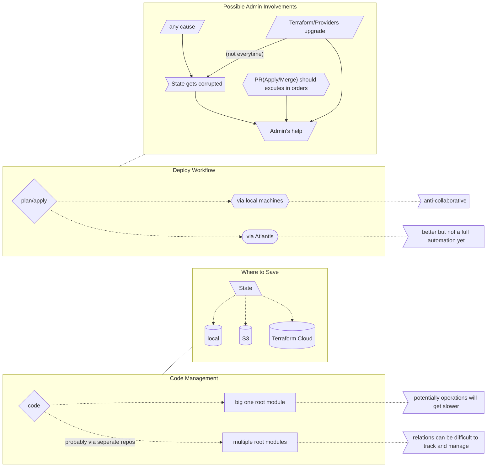

# New Diagrams Are Brewing Here

### Deploy Sequence With Crossplane + Other Enhancements

### User Journey - Deploy via Crossplane + Gitops

### User Journey - Deploy via Terraform + Atlantis

### User Journey - Deploy via Terraform Manually

### Flowchart - Unoptimal Path With Terraform

