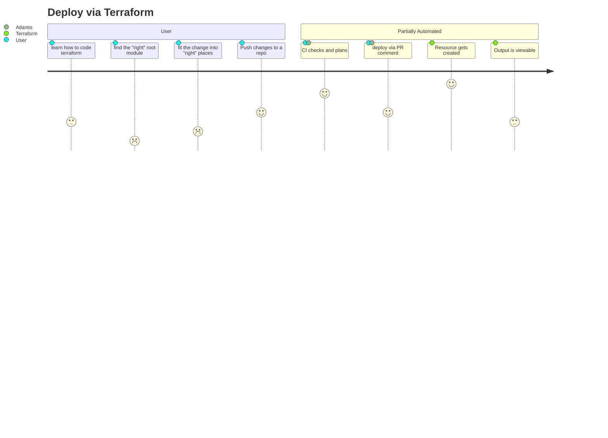

# new diagrams are brewing here

### Deploy sequence with Crossplane

### User journey - Deploy via Crossplane + GitOps

### User journey - Deploy via Terraform + Atlantis

### User journey - Deploy via Terraform manually

```mermaid
journey
  title Deploy via Terraform manually
  section Terraform master
    learn how to code terraform: 3: User
    find the "right" root module: 1: User
    fit the change into "right" places: 2: User
    Ask admin to deploy: 2: User, Admin
    or master deploy and do it yourself: 1: User
    🙏 for repo is synced right away: 2: User
    🙏 for no snowflake local env: 1: User
    🙏 for no untracked vars somewhere: 1: User
```

