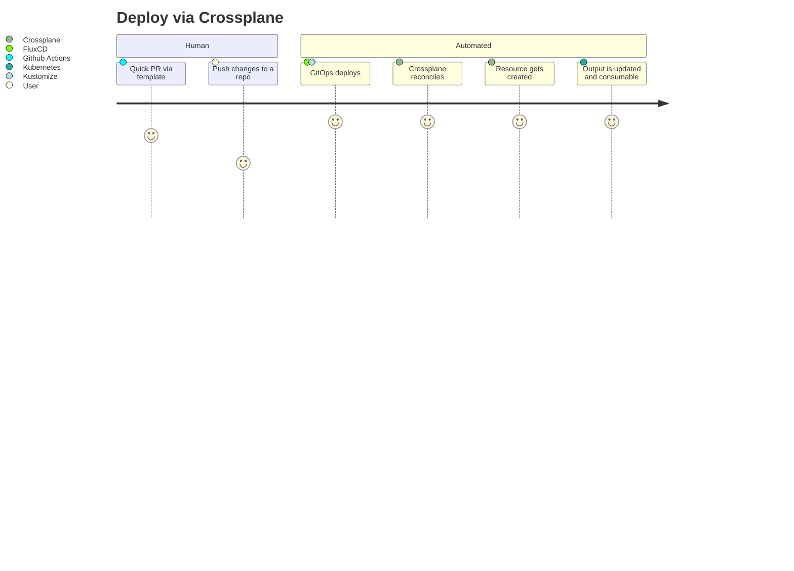
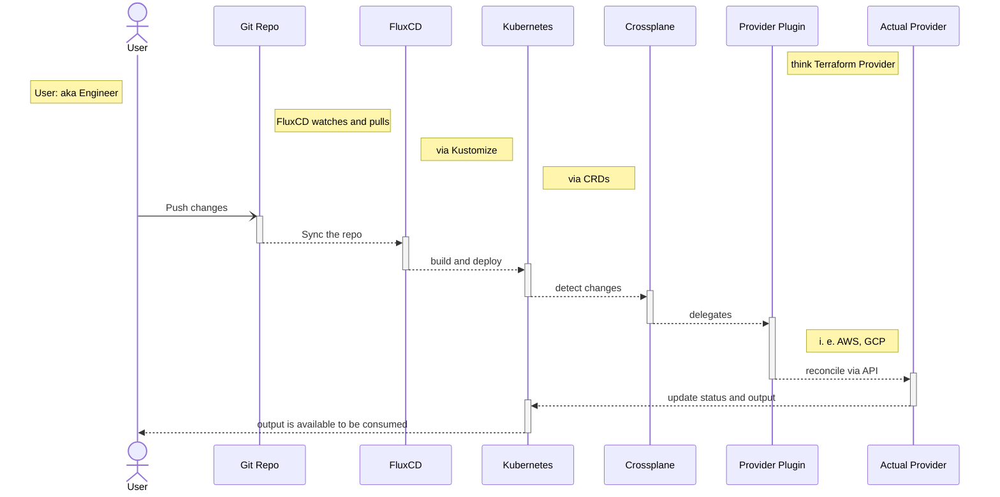

# Why Crossplane
> read [why-not-terraform.md](./why-not-terraform.md) for more context

### Adapts Kubernetes Ways to Infrastructure Management
Are you a fan of Kubernetes? I am. I like how they allow us to declare what we would like to have and Kubernetes just does the work for us.
That eliminates lots of toils of application deployments.

Why should managing infrastructure any different?
You declare a Pod and Kubernetes brings it to a live to you, what should stop us from doing the same for spinning up an RDS instance just by telling Kubernetes that's what we want?

That's where Crossplane comes in to fill that gap.

### Individual Reconciliation for Each Infrastructure Resource
This makes reconciliation task smaller and faster. And they are not tangled to unrelated resources.

### Fits Well With Cloud-agnostic Approach
Why everyone should care what's underneath if it works the same way regardless what's under unless you have a really good reason to?
Kubernetes became popular because it allowed you focus on the contents itself not the nitty-gritty details on how to even have that.

Cloud abstracts the physical hardwares and transforms those to computing resources so that we don't have to deal with different physical ones directly.
Kubernetes abstracts computing resources to be ready use with containers with multiple nodes no matter what underlying cloud provider (or bare metal) you use.

In a sense, CPs are like Assembly Languages, they liberate you from having to talk to the hardwares directly but they differ by each cpu architecture.
In the same sense, Kubernetes is like WebAssembly, It provide a uniform API (if you will) that just works same with different architectures. (Maybe I'm going to far with this but hopefully the idea gets come acrossed)

Humans working more in abstraction level and machines (enabled by code) working more in concrete level makes our work a lot more portable in case of having to migrate where we stand on.

Working with Kubernetes naturally allows us to be more cloud-agnostic than cloud-specific.

### Can Act as Multi Cloud Control Tower
Even in case other tools work better in some cases, Crossplane might be a good candidate for who sits at the very end to fulfill the job of a maestro.

### Refactoring Friendliness
Restructuring YAMLs (moving/renaming) doesn't affect how Kubernetes treat its manifest. Only its contents matter.
So as long as its same in Kubernetes perspective, you have all the flexibility of how to manage your code unlike in [Terraform's case](./why-not-terraform.md#refactoring-unfriendliness).
Pulling out from this repository and moving it to that repository can be also achieved by marking the `deletionPolicy: Orphan` during that code migration.

## Diagrams

### User Journey - Deploy via Crossplane + Gitops

### Deploy Sequence With Crossplane + Other Enhancements

## Other articles
- https://next.redhat.com/2020/10/29/production-ready-deployments-using-the-crossplane-operator-to-manage-and-provision-cloud-native-services/
- https://searchitoperations.techtarget.com/news/252508176/Crossplane-project-could-disrupt-infrastructure-as-code

## Footnote
read [gotchas.md](./gotchas.md)
