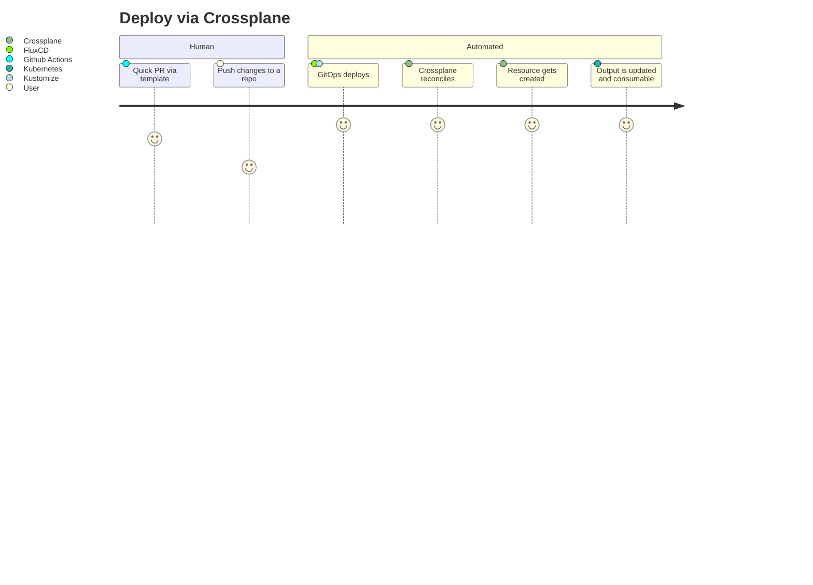
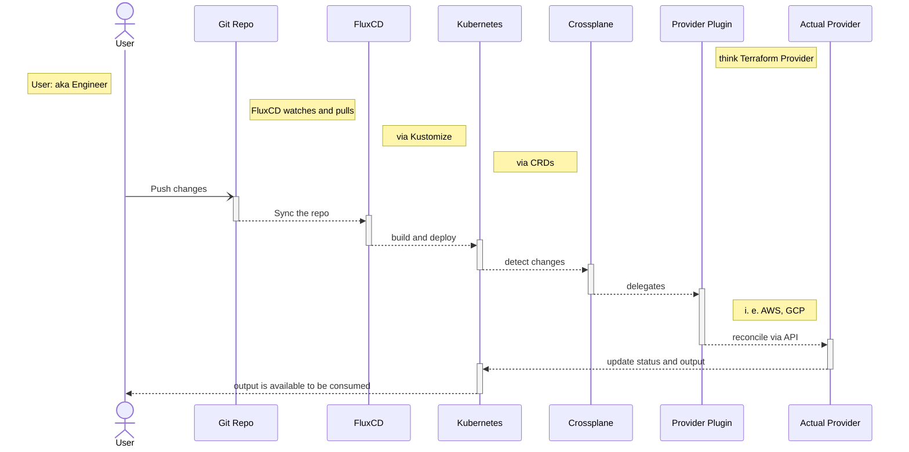

# Why Crossplane (WIP)

read [./why-not-terraform.md](./why-not-terraform.md) for more context

- adapts Kubernetes ways to Infrastructure management
- individual reconciliation for each infrastructure resource
- fits well with cloud-agnostic approach
- can act as multi cloud control tower

## Diagrams

### User Journey - Deploy via Crossplane + Gitops

### Deploy Sequence With Crossplane + Other Enhancements

## Other articles
- https://next.redhat.com/2020/10/29/production-ready-deployments-using-the-crossplane-operator-to-manage-and-provision-cloud-native-services/

## Footnote
read [gotchas.md](./gotchas.md)
